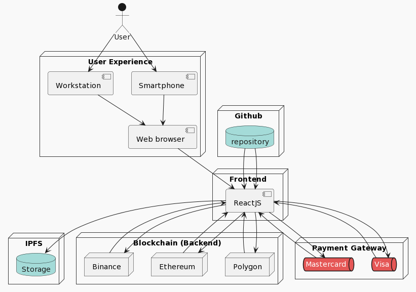

# Blockchain master final project

This repository is a final project work done for the [European University of Madrid](https://universidadeuropea.com/) (_UEM_) of the [Master of Blockchain](https://estudiar.universidadeuropea.com/master-en-blockchain/?utm_source=google&utm_medium=paidsearch&utm_campaign={campaign.name}&utm_term=master%20en%20blockchain&utm_content=always_on&uecrm=7011v0000016zJoAAI).

# FrameBlock :rocket:


Frameblock is a solution that we have developed to simplify and enhance the use of blockchain technology in an agnostic way. With Frameblock, you can easily integrate your applications with any blockchain, regardless of the vendor and technology used. This means you can focus on developing your application without worrying about the underlying complexity of the blockchain technology. Frameblock takes care of making the integration simple, secure and scalable.

* [Technical presentation](doc/frameblock_technical.pptx)
* [Business presentation](doc/frameblock_bussiness.pptx)

We have developed a success story called __Simple AI Collection__ which we explain below:

 __Simple AI Collection__ is a web application that allows users to search, select and create their own collection of artificial intelligence images. The application uses modern technologies such as React, IPFS and smart contracts to store and manage the collections.

## Functionalities :gear:

The application has the following main functionalities:

* **Image search :mag_right::** users can search for AI images using search terms.
* **Image selection :white_check_mark::** Users can select images they like and save them to their collection.
* **Collection management :file_folder::** Users can name their collection and confirm it for storage.
* **Deployment on blockchain :globe_with_meridians::** Users can deploy their collection on blockchain on Ethereum, Binance Smart Chain and Polygon.
* **Deployment payment :credit_card::** Users can pay the deployment fee using a variety of online payment options.

## Technologies 🧑‍💻

The application was built using a number of technologies and tools, including:

* **React :atom_symbol::** A JavaScript library for building user interfaces.
* **IPFS :file_folder::** A decentralized, peer-to-peer file system for storing and sharing files.
* **Smart contracts :ledger::** Digital contracts on blockchain that are used to store and manage application information.
* **Web3 :globe_with_meridians::** A JavaScript library that allows applications to interact with the blockchain.
* **Metamask :key::** A cryptocurrency wallet used to connect to the blockchain.


## Visual Aids

|System Architecture | Process Sequence | 
|--------------------|------------------|
| |  | 


## Installation

To install and run the Simple AI Collection, you will need to have the following installed on your machine:

This dapp is tested in:
- Ubuntu 20.04
- Node Polygon, BNB Smart Chain, et.

### Environment Config

1. [Installed nodejs](doc/nodejs.md)

2. [Download ipfs-node](doc/ipfs.md)

3. Navigate into the project directory

```bash
$ cd dapp
```

4. Install the requirements

```bash
$ npm install
```

5. Make a copy of the example environment variables file

```bash
$ cp .env.example .env
```

6. Add your variables to the newly created `.env` file

```
REACT_APP_API_KEY= ""                   ### API GENERATE WITH OPENIA
REACT_APP_IA_ENDPOINT = ""              ### ENPOINT API OPENIA
REACT_APP_NODE_IP = ""                  ### NODE BSC SMART CHAIN
REACT_APP_PRV_KEY = ""                  ### WALLET PRV KEY
REACT_APP_PUB_KEY = ""                  ### WALLET PUB KEY
REACT_APP_IPFS_NODE = ""                ### IPS NODE
REACT_APP_ABI = []                      ### CONTRACT ABI
REACT_APP_BYTECODE = ""                 ### CONTRACT BYTECODE
NEXT_PUBLIC_STRIPE_PUBLISHABLE_KEY = "" ### PAYMENT GATEWAY PUBLICKEY
NEXT_PUBLIC_STRIPE_PRICE_ID = ""        ### PAYMENT GATEWAY PRICE ID
```

7. Run the dapp

```bash
cd src
npm start
```
# MVP :rocket:


# Acknowledgements

🙌 We would like to express my sincere thanks to all the professors of the Master in Blockchain at **UEM**, who with their teachings and dedication have made possible my training in this fascinating technology. 👨‍🏫👩‍🏫💻

👏 First of all, We would like to thank the director of the master, **Jorge Ordovás Oromendía**, for his warm welcome and for giving us such interesting sessions. 🙏

💯 On the other hand, We would like to express my gratitude to (_for his dedication and originality in teaching_):

* 👨‍🏫 Alberto García García-Castro
* 👨‍🏫 Diego Escalona Rodriguez
* 👨‍🏫 Cesar Rodriguez Cerro
* 👩‍🏫 Ana Cristina Mendiola Gómez
* 👨‍🏫 Alfonso de la Rocha
* 👩‍🏫 María Salgado Iturrino
* 👨‍🏫 Roberto García Álvarez
* 👨‍🏫 Endika Valle Hortelano
* 👩‍🏫 Virginia Díaz Alonso
* 👩‍🏫 Beatriz Macarrón
* 👨‍🏫 Alberto Gómez Toribio
* 👨‍🏫 Pablo Artiñano Muñoz
* 👨‍🏫 Angel García Pujalte
* 👨‍🏫 Alberto López González
* 👨‍🏫 Pedro Lozano

🚀 In short, We thank the entire teaching team of the Master in Blockchain at UEM for their valuable time and effort in providing us with a quality education in this cutting-edge technology. Thank you for your dedication and for sharing with us your knowledge and experience! 🎓

* 👨‍🎓 Roberto Gonzalez Rey
* 👨‍🎓 Sergio Santiago Bendaña Quesada
